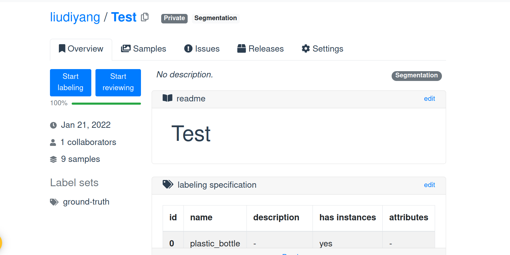

# Labeling Tutorial

To increase the labeling efficiency, we utilize the online tool [segment.ai](https://segments.ai/)

### Step 1

Create your own account and login.

### Step 2

You can create your own dataset or collaborate with others.

#### Collaboration

Ask Fidel to give you the access to the shared dataset. Current labels include 9 classes. You can change the classes to make it more reasonable. The object template example [here](https://segments.ai/liudiyang/ARC_MMDETECTION/) 

#### Create new dataset

Click `New dataset` , add descriptions , select the labeling type(bounding box, segmentation,...), add the object type.

`Add samples` to upload the images you want to annotate. Then start labeling.




### Step 3 

Adjust the super pixel size to a reasonable value.

Click the object, select the label and click `space` key to end one object annotation. After this you can click next object and repeat the procedure.


### Step 4

After labeling and reviewing, export the dataset. [official document here](https://docs.segments.ai/guides/export)

```
pip install segments-ai

# change corresponding client information and output data type in coco_output.
python coco_output.py   
```

